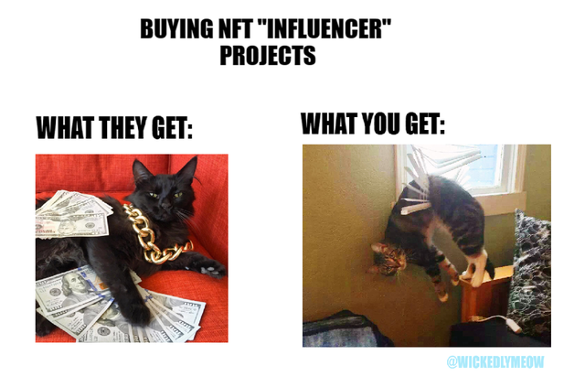
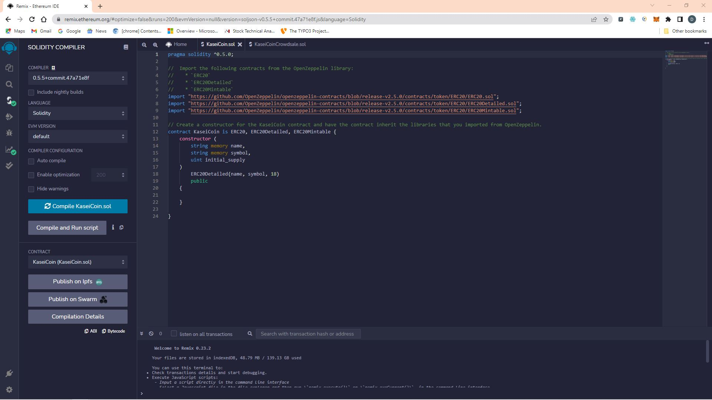
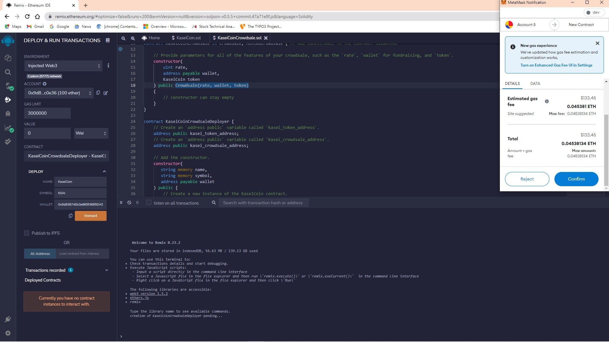
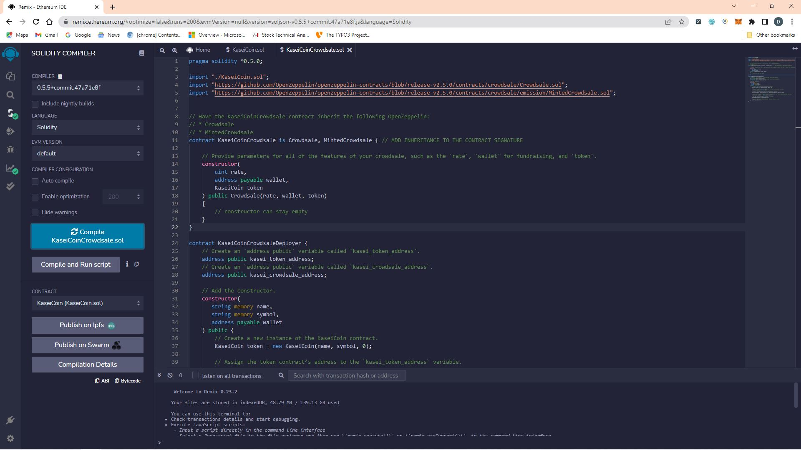
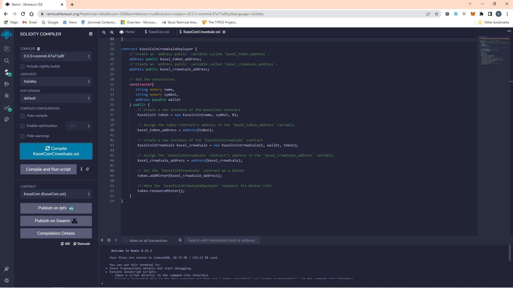
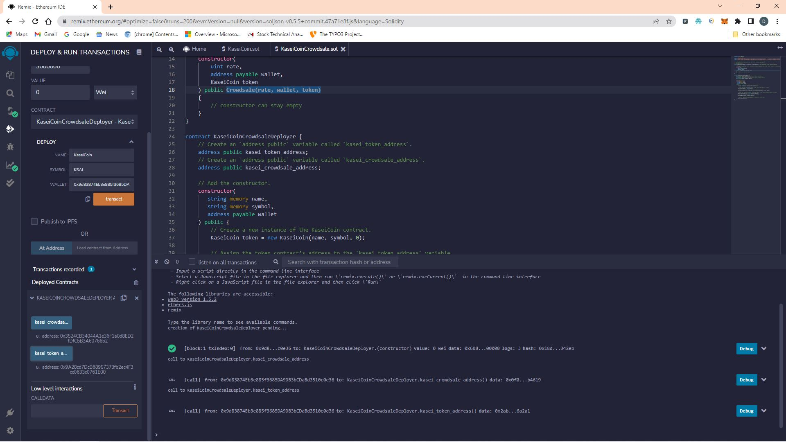
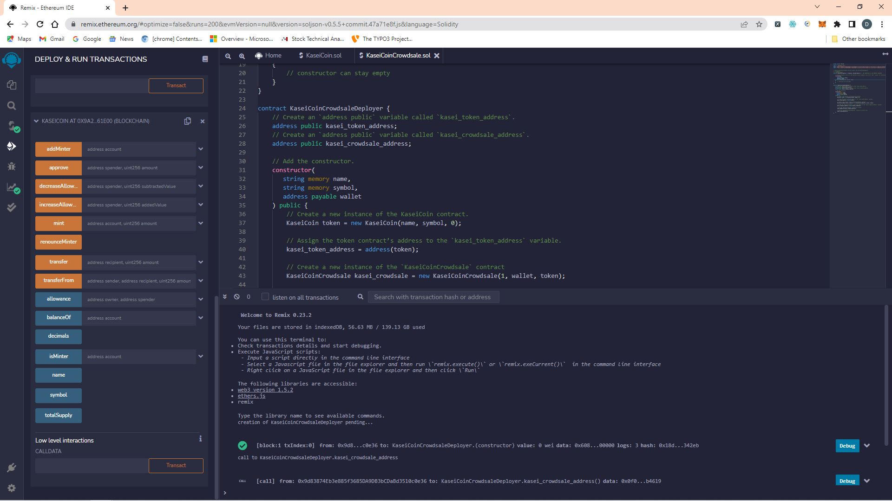
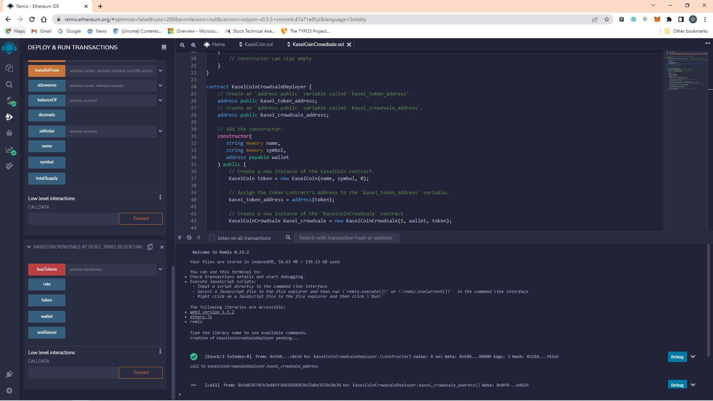
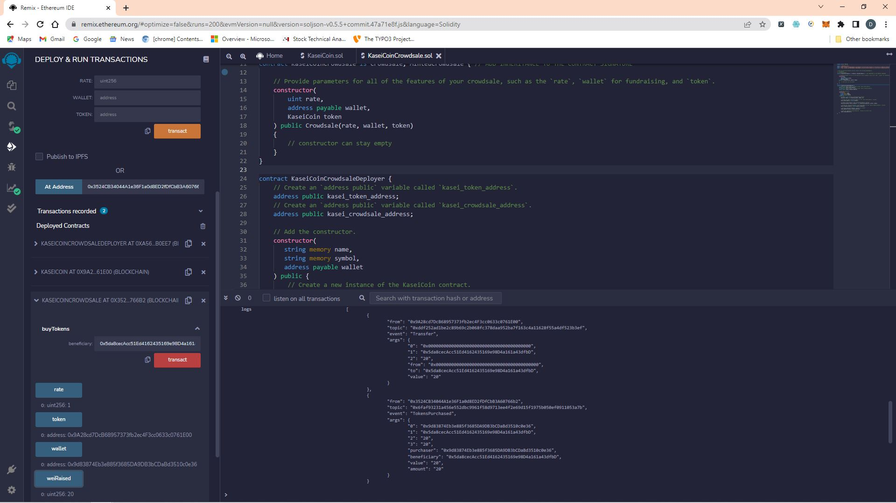

# Unit 21: Martian Token Crowdsale

## Background

After waiting for years and passing several tests, the Martian Aerospace Agency selected you to become part of the first human colony on Mars. As a prominent fintech professional, they chose you to lead a project developing a monetary system for the new Mars colony. You decided to base this new system on blockchain technology and to define a new cryptocurrency named **KaseiCoin**. (Kasei means Mars in Japanese.)

KaseiCoin will be a fungible token that’s ERC-20 compliant. You’ll launch a crowdsale that will allow people who are moving to Mars to convert their earthling money to KaseiCoin.

## Files

Download the following files to help you get started:

[KaseiCoin.sol](./KaseiCoin.sol)

[KaseiCoinCrowdsale.sol](./KaseiCoinCrowdsale.sol)

## Instructions

The steps for this assignment are divided into the following subsections:

1. Create the KaseiCoin Token Contract

2. Create the KaseiCoin Crowdsale Contract

3. Create the KaseiCoin Deployer Contract

4. Deploy and Test the Crowdsale on a Local Blockchain

5. Optional: Extend the Crowdsale Contract by Using OpenZeppelin

    > **Note:** You can choose whether to complete the optional section. It’s designed to further your professional growth and development but won’t be graded as part of this assignment. If you choose to complete this section, you’ll use OpenZeppelin to extend the functionality of your crowdsale contract by adding time restrictions, refund capabilities, and a cap for the number of tokens that can be created. If you have any questions about how to complete the optional section, please reach out to your instructional team.

Note that the provided starter files for this homework assignment contain a `pragma` statement for Solidity version 0.5.0. You’ll use the starter files to complete the steps in the subsections.

In the subsections, you’ll create a fungible token that’s ERC-20 compliant. This token will be minted by using a `Crowdsale` contract from the OpenZeppelin Solidity library.

The crowdsale contract that you create will manage the entire crowdsale process. This process will allow users to send ether to the contract and receive KaseiCoin tokens, or **KAI**, in return. Your contract will automatically mint the tokens and distribute them to a buyer in one transaction.

Note that you’ll record a short video or animated GIF or take several screenshots that show the deployed contract in action.

### Evaluation Evidence
First, compliling the KaseiCoin contract

Second, compliling the KaseiCoin Crowdsale contract

Third, compliling the KaseiCoin Deployer contract

Fourth, with the token creation, the kasei_crowdsale_address and kasei_token_address can be obtained.

Fifth, the KaseiCoin contract can be loaded by selecting the KaseiCoin contract and loading the contract address

Sixth, the KaseiCoinCrowdsale contract is used for buying new tokens.

Seventh, purchasing from the new contract, and confirming the wei raised.

Eigth, checking the balance of the account coin is purchased in.

